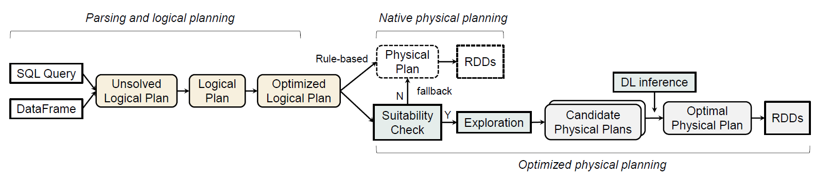

# A Practical Deep Learning Based Optimization System for Big Data Query
 
Big data query systems like Spark SQL rely on rule-based methods to select an execution plan, which can often be sub-optimal. Recent studies have attempted to use deep learning models to predict query performance in relational databases and big data processing frameworks. However, integrating deep learning models with Spark SQL poses system challenges including efficient candidate plan exploration and real-time model inference, which have yet to be fully resolved and result in the previous works being research prototypes. In this paper, we propose an end-to-end deep-learning-based query optimization that is seamlessly integrated with the native Spark system and practically reduces query execution time. We modify Spark's core logic to expand the plan exploration space, design an LSTM-based model to estimate the cost of candidate plans, and establish a companion server for deep learning model inference. Experimental results demonstrate that our system brings more than 13\% performance improvement on public benchmarks compared to native Spark.




## Structure

- The modified Spark is located at `./spark-3.2.1-modified`

- The deep cost estimiation *development* module is located at `./dsso-dev`

- The deep cost estimiation *deployment* module is located at `./dsso-deploy` 

- Scala code for training data generation and end-to-end evaluation is located at `./dsso-test` 

- The queries used for DL model development is located at `./data`


## Usage: DL-enhanced Spark SQL Execution

- Build the modified Spark 
```
   cd DIR_TO_MODIFIED_SPARK
    ./build/sbt package
```
- Run a spark-submit application with cost-estimation-based optimization enabled (example)
```
bash DIR_TO_MODIFIED_SPARK/bin/spark-submit\
    --class TestXXX\
    --master spark://gpu1040.sqa.eu95:7077\
    --executor-memory 16g\
    --total-executor-cores 48\
    --executor-cores 2\
    --driver-memory 50g\
    --conf spark.sql.autoBroadcastJoinThreshold=8g\
    --conf spark.sql.objectHashAggregate.sortBased.fallbackThreshold=4096\
    --conf spark.sql.ceo=true\
    --conf spark.sql.ceoDir=xxx/cost-estimation-deploy\
    --conf spark.sql.ceoServerIP=xx.xx.xx.xx\
    --conf spark.sql.ceoPruneAggressive=true\
    --conf spark.sql.ceoMetadataDir=xxx/xx-metadata\
    --conf spark.sql.ceoLengthThreshold=32\
    xxx.jar inputArgs
```

| Config|  Explantion|
|-------|------------|
|spark.sql.autoBroadcastJoinThreshold| Set this native configuration to a large value (8g) to ensure thorough exploration.|
spark.sql.objectHashAggregate.sortBased.fallbackThreshold | Set this native configuration to a large value (4096) to ensure thorough exploration.|
|spark.sql.ceo | Set true to enable cost-estimation-based optimization (default = false).|
|spark.sql.ceoDir | Directory to the deployment folder, which contains the trained model and facilitative files (default = "/").|
|spark.sql.ceoServerIP | The IP of the DL companion server. If the server is `localhost`, it can be automatically started by SparkSession, otherwise it has to be manually start (default = "127.0.0.1").|
|spark.sql.ceoServerPort | The port of the DL companion server (default = "8308").|
|spark.sql.ceoPruneAggressive | Set true to enable aggressive pruning (default = false).|
|spark.sql.ceoMetadataDir | Directory storing the metada file of the tables (default = "").|
|spark.sql.ceoLengthThreshold | The plan length threshold of enabling cost-estimation-based optimization (default=500).|

## Usage: DL model development

Dependencies (from `pip`):
```
pytorch
scikit-learn
fse
gensim
```

- Data generation

    ```cd dsso-dev```

    `RecordQueryTime.scala` explains the process of generating training data 

- Moel training

    ```cd dsso-dev```

    First run `node_embedding_xxx.ipynb`, then run `lstm_xxx.ipynb`.

    Once the model is trained, move the trained model and the encoding files to `./dsso-deploy`.
